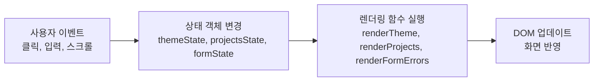

# 나를 소개하는 웹페이지 (Vanilla Web Portfolio)

> 외부 라이브러리(React, Tailwind 등) 없이 순수 **HTML5, CSS3, ES6+ JavaScript**만으로 제작된 반응형 포트폴리오 웹사이트입니다.  
> 웹 프론트엔드의 핵심인 **"사용자 이벤트 → 상태(State) 변경 → DOM 조작(화면 렌더링)"**의 흐름을 직접 구현했습니다.

---

## 📌 프로젝트 개요
- **작성자 / GitHub**: [ottermere21](https://github.com/ottermere21)
- **과제 목표**: React 등 모던 프레임워크 학습 전, 웹 표준(HTML 시맨틱 태그), 모바일 퍼스트 CSS 레이아웃, Vanilla DOM 조작, 비동기 통신(Fetch API) 및 상태 기반 렌더링 구조 체득
- **배포 주소 (GitHub Pages)**: `https://ottermere21.github.io/codyssey-b1-1-webpage/` (배포 예정 URL)

---

## 🛠️ 기술 스택 (Tech Stack)

- **HTML5**: 시맨틱 태그(`header`, `nav`, `main`, `section`, `article`, `footer`) 기반 구조화, 웹 접근성(`alt`, `label for-id`, `aria` 속성) 준수
- **CSS3**: CSS 변수(`:root`, `[data-theme="dark"]`), Flexbox, CSS Grid(`auto-fit`, `minmax`), 모바일 퍼스트 미디어 쿼리(768px, 1024px)
- **JavaScript (ES6+)**: `const`/`let`, 화살표 함수, 구조 분해 할당, 템플릿 리터럴, 배열 메서드(`map`), 비동기(`async`/`await`, `fetch`), DOM & 이벤트 핸들링
- **아이콘 및 폰트**: Font Awesome 6.5, Google Fonts (Outfit, Inter, Noto Sans KR)

---

## ✨ 핵심 기능 및 구현 상세

### 1. 시맨틱 마크업 & 6대 필수 섹션
1. **Hero**: 인삿말, 소개 타이틀, CTA 바로가기 버튼
2. **About**: 프로필 아바타 이미지, 개발 철학, 세부 정보 리스트
3. **Skills**: 핵심 기술 스택 카드
4. **Projects**: GitHub API 연동을 통한 동적 카드 렌더링
5. **Contact**: 필수값 및 이메일 형식 유효성 검사 폼
6. **Footer**: 저작권 연도 자동 갱신, 소셜 링크

### 2. 반응형 레이아웃 (모바일 퍼스트)
- **모바일 (< 768px)**: 햄버거 메뉴 토글 방식, 1열 레이아웃
- **태블릿 (≥ 768px)**: 가로 네비게이션 노출, About 2열 분할, 그리드 2열 확장
- **데스크톱 (≥ 1024px)**: 최대 너비 1140px 중앙 정렬, 프로젝트 그리드 3열 확장

### 3. 인터랙션 및 기준값 명시 (요구사항)
- **다크 모드 토글**: 클릭 시 테마 상태 변경 및 `localStorage` 영속화로 새로고침 후에도 유지
- **스크롤 네비게이션 스타일 변경**: **스크롤 60px 이상** 시 헤더에 블러 및 배경색/그림자(`box-shadow`) 적용
- **스크롤 탑(Back-to-Top) 버튼**: **스크롤 300px 이상** 시 우측 하단 플로팅 버튼 노출, 클릭 시 최상단으로 부드러운 스크롤 이동
- **스크롤 진입 애니메이션**: **`Intersection Observer API` (Threshold: 0.2)** 를 적용하여 화면의 20% 이상 진입 시 부드러운 페이드인 효과 실행
- **햄버거 메뉴 토글**: 모바일 환경에서 메뉴 열림/닫힘 및 링크 클릭 시 자동 닫힘 처리

### 4. GitHub API 비동기 연동 & 4대 UI 상태 처리
`https://api.github.com/users/ottermere21/repos?sort=updated&per_page=12` 엔드포인트를 `async/await`로 호출하며 4가지 상태를 관리합니다:
1. **로딩(Loading)**: 데이터 요청 중 회전 스피너와 안내 텍스트 노출
2. **성공(Success)**: 응답 받은 레포지토리 목록을 `map()` 함수와 템플릿 리터럴로 동적 카드 생성
3. **실패(Error)**: 네트워크 오류 또는 403 Rate Limit 발생 시 에러 안내와 **[다시 시도]** 버튼 표시
4. **빈 데이터(Empty)**: 레포지토리가 없을 경우 "표시할 프로젝트가 없습니다" 안내

### 5. Contact 폼 유효성 검사 (UX)
- `event.preventDefault()`를 통해 새로고침 방지
- 이름, 이메일, 메시지 필드 필수값 검증
- 이메일 정규표현식(`/^[^\s@]+@[^\s@]+\.[^\s@]+$/`) 검사
- 에러 발생 시 입력 필드 테두리 강조 및 인라인 에러 메시지 실시간 렌더링
- 실시간 `input` 이벤트 발생 시 에러 메시지 즉시 해제
- 검증 통과 시 성공 알림 표시 및 폼 초기화(`form.reset()`)

---

## 🔄 상태 관리 흐름 (State → Render Pattern)

본 프로젝트에서는 React의 컴포넌트 렌더링 원리와 동일한 **"이벤트 → 상태 변경 → DOM 렌더링"** 단방향 흐름을 구현했습니다.



1. **테마 상태**:
   - `themeToggle.click` → `themeState.theme` ('light' ↔ 'dark') → `renderTheme()` 실행하여 `html[data-theme]` 변경
2. **프로젝트 API 상태**:
   - `fetchGitHubRepos()` 호출 → `projectsState.status` ('loading' → 'success' | 'error' | 'empty') → `renderProjects()` 실행하여 해당 상태 UI 렌더링
3. **폼 유효성 상태**:
   - `contactForm.submit` / `input` → `formState.errors` 갱신 → `renderFormErrors()` 실행하여 각 필드별 에러/정상 스타일 렌더링

---

## 🚀 로컬 실행 방법

1. 저장소 클론:
   ```bash
   git clone https://github.com/ottermere21/codyssey-b1-1-webpage.git
   cd codyssey-b1-1-webpage
   ```
2. VS Code에서 열기:
   ```bash
   code .
   ```
3. VS Code의 **Live Server** 확장을 실행하거나 브라우저에서 `index.html` 파일을 직접 엽니다.

---

## 🌐 GitHub Pages 배포 방법

1. 코드를 본인의 GitHub 저장소의 `main` 브랜치에 푸시합니다.
2. GitHub 저장소 상단 탭에서 **Settings** → 좌측 **Pages** 메뉴로 이동합니다.
3. **Build and deployment** 항목의 Source를 **Deploy from a branch**로 선택합니다.
4. Branch를 `main` / `/ (root)`로 지정하고 **Save**를 클릭합니다.
5. 1~2분 후 생성되는 배포 URL(`https://<username>.github.io/<repo-name>/`)에서 정상 동작을 확인합니다.
