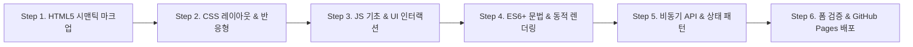

이번 미션(**나를 소개하는 웹페이지 처음부터 만들기**)은 외부 라이브러리(React, Vue, Tailwind 등) 없이 **순수 HTML, CSS, JavaScript**만을 사용해 반응형 웹사이트를 제작하는 과제입니다.

이 미션의 핵심 목표는 **"사용자 이벤트 → 상태 변경 → DOM 업데이트(화면 반영)"**라는 웹의 본질적인 동작 흐름을 손으로 직접 경험하는 것입니다. (이 흐름을 확실히 이해해야 이후 **React의 컴포넌트, State, useEffect**를 배울 때 수월해집니다.)

처음부터 모든 것을 한 번에 하려고 하면 막막할 수 있으므로, 아래의 **6단계 학습 로드맵** 순서대로 차근차근 공부하며 기능을 구현해 나가는 것을 추천합니다.

---

### 🗺️ 단계별 학습 로드맵

---

#### 1단계: HTML5 시맨틱 마크업 (문서 뼈대 잡기)
웹 표준과 웹 접근성을 지키며 웹페이지의 구조를 설계하는 단계입니다.

* **공부할 핵심 키워드**:
  * **시맨틱 태그(Semantic Tags)**: `
`로만 감싸지 않고 `<header>`, `<nav>`, `<main>`, `<section>`, `<article>`, `<footer>`를 목적에 맞게 사용하는 이유
  * **웹 접근성 기본**: ``의 `alt` 속성, 폼에서 `<label for="id">`와 `<input id="id">` 연결
  * **내부 앵커 링크**: `<a href="#section-id">`를 활용한 페이지 내 이동
* **이 단계의 미션 목표**:
  * 화면 스타일링을 하기 전, 필요한 6개 섹션(Hero, About, Skills, Projects, Contact, Footer)의 시맨틱 뼈대 작성 완료하기.

---

#### 2단계: CSS 스타일링 & 반응형 레이아웃 (옷 입히기)
화면 크기(모바일/태블릿/데스크톱)에 맞춰 유연하게 반응하는 디자인을 만듭니다.

* **공부할 핵심 키워드**:
  * **CSS 변수 (`:root`)**: 테마 색상, 폰트, 간격을 변수로 관리하는 법 (다크 모드 구현의 기반)
  * **Flexbox**: 1차원 정렬. 네비게이션 바(로고 왼쪽, 메뉴 오른쪽 정렬)에 적용
  * **CSS Grid**: 2차원 배치. `grid-template-columns: repeat(auto-fit, minmax(280px, 1fr))` 등을 활용한 반응형 카드 그리드
  * **미디어 쿼리(Media Query) & 모바일 퍼스트**: 작은 모바일 화면 스타일을 기본으로 작성하고, `@media (min-width: 768px)`(태블릿), `1024px`(데스크톱)로 점진적 확장
  * **CSS 효과**: `transition`, `:hover` 가상 클래스, `box-shadow`
* **이 단계의 미션 목표**:
  * 모바일에서는 네비 메뉴가 숨겨지고, 태블릿/데스크톱에서는 가로로 펼쳐지는 레이아웃 완성하기.

---

#### 3단계: JavaScript DOM 제어 & UI 인터랙션 (생명 불어넣기)
사용자의 클릭, 스크롤 동작에 반응하도록 만듭니다.

* **공부할 핵심 키워드**:
  * **스크립트 로드 방식**: `<script defer src="...">`의 동작 원리
  * **변수 선언**: `var` 대신 `const`와 `let`을 써야 하는 이유 (스코프 차이)
  * **DOM 탐색 & 조작**: `document.querySelector()`, `querySelectorAll()`
  * **클래스 조작**: 인라인 스타일 대신 `element.classList.add()`, `remove()`, `toggle()` 사용하기
  * **이벤트 리스너**: `addEventListener('click', ...)`
  * **스크롤 이벤트 & 최적화**: `window.scrollY` 감지 및 최신 웹 API인 **`Intersection Observer API`**(화면에 요소가 나타날 때 애니메이션 처리)
  * **로컬스토리지 (`localStorage`)**: 다크 모드 설정값을 브라우저에 저장하고 새로고침 후에도 유지하기
* **이 단계의 미션 목표**:
  * 햄버거 메뉴 토글, 맨 위로 가기(Top) 버튼, 스크롤 시 헤더 배경색 변경, 다크 모드 토글 완성하기.

---

#### 4단계: 모던 자바스크립트(ES6+) & 데이터 다루기
정적인 HTML을 직접 타이핑하는 것이 아니라, 자바스크립트 데이터(배열, 객체)를 바탕으로 화면을 동적으로 만듭니다.

* **공부할 핵심 키워드**:
  * **화살표 함수 (Arrow Function)**: `const fn = () => { ... }`
  * **템플릿 리터럴**: 백틱(`` ` ``)과 `${}` 표현식을 이용한 HTML 문자열 동적 생성
  * **구조 분해 할당(Destructuring)**: `const { name, description, stargazers_count } = repo;`
  * **배열 고차 함수**:
    * `map`: 데이터를 순회하며 HTML 카드 템플릿 문자열로 변환
    * `filter`: 조건에 맞는 데이터만 추리기 (보너스 과제: 언어별 필터링)
    * `forEach`: 단순 순회
* **이 단계의 미션 목표**:
  * 임의의 가짜(mock) 데이터 배열을 만들어 `map`과 템플릿 리터럴로 프로젝트 카드를 화면에 동적으로 렌더링해보기.

---

#### 5단계: 비동기 통신(Fetch API)과 상태(State) 처리 (★핵심★)
외부 서버에서 데이터를 받아오고, 통신 상태에 따라 화면을 갈아 끼우는 React의 핵심 사고방식을 배웁니다.

* **공부할 핵심 키워드**:
  * **비동기 자바스크립트**: `Promise`, `async` / `await`, `try...catch` 예외 처리
  * **Fetch API**: `fetch('https://api.github.com/users/{username}/repos')`로 GitHub 레포지토리 목록 불러오기
  * **GitHub API 제약사항**: 인증 없는 요청 시 시간당 60회 제한(403 Rate Limit) 처리
  * **4가지 UI 상태 처리 (State → View)**:
    1. **로딩(Loading)**: 데이터 요청 중 스피너 또는 "로딩 중..." 텍스트 표시
    2. **성공(Success)**: 데이터를 받아와서 카드 그리드로 표시
    3. **실패(Error)**: 에러 발생 시 안내 문구와 [다시 시도] 버튼 표시
    4. **빈 데이터(Empty)**: 레포지토리가 없을 때 안내 문구 표시
* **이 단계의 미션 목표**:
  * 내 GitHub 아이디의 레포지토리를 가져와 4가지 상태별로 화면이 올바르게 바뀌는지 테스트하기.

---

#### 6단계: 폼 UX & 배포 (마무리)
사용자 입력 검증과 배포를 진행합니다.

* **공부할 핵심 키워드**:
  * **이벤트 제어**: `event.preventDefault()`로 폼 제출 시 브라우저 기본 새로고침 방지
  * **유효성 검사(Validation)**: 빈 값 체크, 정규표현식(RegEx)을 이용한 이메일 형식 검사
  * **GitHub Pages 배포**: 내 저장소 Settings → Pages를 통해 정적 웹사이트 배포하기
  * **README.md 작성**: 프로젝트 소개, 배포 URL, 데스크톱/모바일 스크린샷 정리
